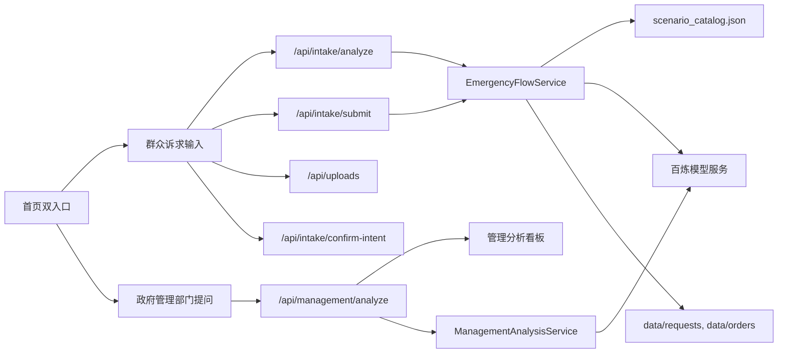

# 问办通技术方案文档

## 1. 项目概述

问办通是面向社会民生问题的多智能体协同调度 Demo，目标是同时解决两类核心问题：

- 群众诉求快速回应：群众通过文本、图片或语音描述问题，系统辅助完成诉求理解、复述确认、风险判断和工单生成。
- 政府资源合理分配：政府管理部门输入公共服务治理问题，系统检索并汇总相关群众诉求，生成时空分布、类别图表、地区标注和资源配置建议。

当前可运行产品 Demo 聚合了两个入口：

- 群众入口：`/citizen`
- 政府管理部门入口：`/management`

首页统一入口为：`/`

## 2. 产品 Demo 访问路径

本地运行后可访问：

- 首页：`http://127.0.0.1:5173/`
- 群众诉求输入界面：`http://127.0.0.1:5173/citizen`
- 政府管理部门分析界面：`http://127.0.0.1:5173/management`
- 管理分析数据看板：`http://127.0.0.1:5173/management/dashboard`
- 后端健康检查：`http://127.0.0.1:8000/health`
- 后端接口文档：`http://127.0.0.1:8000/docs`

## 3. 总体工程架构



### 前端架构

前端采用 Vue 3 + Vite + Pinia + Vue Router。

- 页面路由：`frontend/src/router/index.ts`
- 首页：`frontend/src/pages/HomePage.vue`
- 群众入口：`frontend/src/pages/EmergencyDashboardPage.vue`
- 政府管理部门入口：`frontend/src/pages/ManagementAnalysisPage.vue`
- 管理分析看板：`frontend/src/pages/ManagementDashboardPage.vue`
- 群众端状态管理：`frontend/src/stores/emergency.ts`
- 管理端状态管理：`frontend/src/stores/management.ts`
- 群众端 API 封装：`frontend/src/api/emergency.ts`
- 管理端 API 封装：`frontend/src/api/management.ts`

### 后端架构

后端采用 FastAPI，核心服务拆分为群众诉求处理和管理分析两条链路。

- FastAPI 入口：`backend/app/main.py`
- 路由定义：`backend/app/api/routes.py`
- 配置与环境变量：`backend/app/core/settings.py`
- 群众诉求服务：`backend/app/services/emergency_flow_service.py`
- 管理分析服务：`backend/app/services/management_analysis_service.py`
- 百炼模型调用：`backend/app/integrations/bailian/client.py`
- JSON 文件存储：`backend/app/repositories/file_store/json_file_repository.py`
- 附件上传存储：`backend/app/repositories/uploads/upload_file_repository.py`

## 4. 核心算法设计

### 4.1 群众诉求识别与派单算法

群众入口采用“规则优先 + 模型增强 + 本地兜底”的混合策略。

处理流程：

1. 用户输入诉求文本，或上传图片 / 语音材料。
2. 前端根据文本初步推断诉求类型、标签、小区和位置。
3. 后端 `/api/intake/analyze` 对诉求进行预分析，不写入正式工单。
4. 系统生成客服复述确认话术。
5. 工作人员确认后，前端调用 `/api/intake/submit` 生成正式工单。
6. 后端写入 `data/requests/` 和 `data/orders/`。

主要识别逻辑在：

- `frontend/src/stores/emergency.ts`
- `backend/app/services/emergency_flow_service.py`

当前支持的规则场景包括：

- 水管爆裂 / 漏水 / 积水：派发到物业工程维修组。
- 公共照明 / 停电：派发到物业电工班。
- 餐饮油烟 / 夜间噪声：派发到属地街道综合执法队，并联动生态环境、市场监管和社区。
- 电梯异常、消防通道堵塞等场景在前端可视节点中保留。
- 未命中规则时进入通用公共服务诉求处理。

关键算法点：

- 文本关键词识别：使用关键词集合判断场景，例如“水管、漏水、爆了、积水、电梯里”命中 `water_pipe_burst`。
- 规则优先：明确文本场景先快速返回标准处置结果，避免外部模型调用延迟影响演示。
- 模型一致性校验：如果模型返回的类别与规则场景冲突，后端采用规则场景下的标准目录，避免“水管爆裂被识别为油烟”的问题。
- 缺失字段检测：后端根据位置、门牌、楼栋、商户名称等字段判断是否需要继续补充。
- 确认意图识别：先用规则判断“确认 / 取消 / 修改”等短句，再调用模型做兜底。

### 4.2 管理部门问题分析算法

管理入口面向政府管理人员提出的治理问题，例如：

> 夏天中暑情况增多，我应该如何分配医疗资源？

处理流程：

1. 管理人员输入问题、区域和时间范围。
2. 系统抽取主题、关键词、资源对象和关注人群。
3. 后端构造 50 条相关群众诉求记录，作为检索汇总后的分析样本。
4. Agent 面板动态展示“问题理解 - 诉求检索 - 时空聚合 - 资源建议”的过程。
5. 看板展示时间趋势、类别占比、地区标注、问题回答和资源建议。

核心实现路径：

- 管理分析服务：`backend/app/services/management_analysis_service.py`
- 管理请求 / 响应结构：`backend/app/schemas/management.py`
- 管理分析页面：`frontend/src/pages/ManagementAnalysisPage.vue`
- Agent 动态过程：`frontend/src/components/ManagementAgentFlowPanel.vue`
- 管理看板：`frontend/src/pages/ManagementDashboardPage.vue`

关键算法点：

- 主题匹配：根据输入问题命中高温中暑、油烟噪声、养老照护、交通秩序、通用公共服务等主题库。
- 关键词抽取：优先使用本地主题词，未命中时按中文标点和空格切分生成关键词。
- 诉求样本构造：基于问题文本、区域和时间范围生成稳定随机种子，保证同一问题多次演示结果一致。
- 时序聚合：按日期统计诉求量与高风险诉求数量。
- 类别聚合：用 `Counter` 统计问题类别占比。
- 地区聚合：按社区统计诉求数量、高风险数量、最高频类别和建议动作。
- 资源建议：综合热点社区、高风险数量、类别占比和资源需求输出治理建议。

## 5. 数据设计

### 5.1 静态规则数据

场景规则目录：

- `data/reference/scenario_catalog.json`

该文件定义群众诉求场景的类别、紧急程度、影响范围、风险点、建议补充问题、临时处置建议、责任单位、协办单位、SLA 和工单动作。

样例诉求：

- `data/requests/sample_restaurant_fume_noise.json`
- `data/requests/sample_water_pipe_burst.json`

### 5.2 运行时数据

运行时数据通过 JSON 文件写入本地目录：

- 正式诉求记录：`data/requests/`
- 工单记录：`data/orders/`
- 上传附件：`data/uploads/`
- 运行时缓存：`data/runtime/`

这些目录由 `backend/app/core/settings.py` 中的 `ensure_data_directories()` 自动创建。

### 5.3 管理分析数据结构

管理端返回结构定义在：

- `backend/app/schemas/management.py`

主要字段包括：

- `records`：相关群众诉求记录。
- `agent_steps`：Agent 分析步骤。
- `time_series`：时间趋势。
- `category_metrics`：类别占比。
- `region_insights`：地区标注和资源建议。
- `answer`：对管理问题的回答。
- `recommendations`：行动建议列表。

## 6. 模型调用方案

模型调用统一封装在：

- `backend/app/integrations/bailian/client.py`

环境变量配置：

- `BAILIAN_API_KEY`
- `BAILIAN_BASE_URL`
- `BAILIAN_VLM_MODEL`
- `BAILIAN_INTENT_MODEL`
- `BAILIAN_ASR_MODEL`

默认模型：

- 文本 / 图像理解：`qwen3.6-plus`
- 确认意图识别：`qwen-turbo`
- 语音识别：`fun-asr-realtime-2026-02-28`

### 6.1 群众诉求模型增强

调用路径：

- `EmergencyFlowService.handle_report()`
- `BailianClient.analyze_report()`

输入内容：

- 诉求人姓名
- 小区名称
- 联系方式
- 发生位置
- 输入方式
- 标签
- 文本描述
- 图片附件（最多取前 2 张）

模型输出 JSON 字段：

- `summary`
- `category`
- `urgency`
- `impact_scope`
- `risks`
- `requires_immediate_visit`
- `suggested_questions`
- `temporary_guidance`
- `route_hint`
- `service_notes`

### 6.2 语音识别

调用路径：

- `BailianClient._transcribe_primary_audio()`

当 `input_type` 为 `audio` 且存在音频附件时，调用 ASR 模型生成转写文本，再进入诉求分析链路。

### 6.3 管理问题主题解析

调用路径：

- `ManagementAnalysisService._call_ai_profile()`

当配置了 `BAILIAN_API_KEY` 时，管理端会调用模型辅助抽取：

- `topic`
- `keywords`
- `categories`
- `resources`
- `groups`
- `answer_focus`

如果模型不可用，则使用本地主题库兜底，不影响 Demo 完整演示。

## 7. API 接口

接口定义在：

- `backend/app/api/routes.py`

| 方法 | 路径 | 功能 |
| --- | --- | --- |
| `GET` | `/health` | 健康检查 |
| `POST` | `/api/uploads` | 上传图片或音频附件 |
| `POST` | `/api/intake/analyze` | 群众诉求预分析，不写入正式工单 |
| `POST` | `/api/intake/submit` | 群众诉求正式提交并生成工单 |
| `POST` | `/api/intake/confirm-intent` | 判断用户是否确认客服复述 |
| `POST` | `/api/management/analyze` | 管理部门问题分析并返回看板数据 |

## 8. 系统实现路径

### 8.1 首页双入口

- `frontend/src/pages/HomePage.vue`
- `frontend/src/router/index.ts`

首页提供两个入口：

- `RouterLink to="/citizen"`
- `RouterLink to="/management"`

### 8.2 群众诉求全链路

- 页面：`frontend/src/pages/EmergencyDashboardPage.vue`
- 左侧对话受理：`frontend/src/components/LeftReportPanel.vue`
- 中间路由 Agent 可视化：`frontend/src/components/RouteFlowPanel.vue`
- 右侧工单派发：`frontend/src/components/RightServicePanel.vue`
- 状态管理：`frontend/src/stores/emergency.ts`
- API 调用：`frontend/src/api/emergency.ts`
- 后端服务：`backend/app/services/emergency_flow_service.py`
- 后端模型调用：`backend/app/integrations/bailian/client.py`
- 规则目录：`data/reference/scenario_catalog.json`

### 8.3 政府管理部门分析全链路

- 页面：`frontend/src/pages/ManagementAnalysisPage.vue`
- Agent 过程面板：`frontend/src/components/ManagementAgentFlowPanel.vue`
- 数据看板：`frontend/src/pages/ManagementDashboardPage.vue`
- 状态管理：`frontend/src/stores/management.ts`
- API 调用：`frontend/src/api/management.ts`
- 后端服务：`backend/app/services/management_analysis_service.py`
- 后端结构定义：`backend/app/schemas/management.py`

## 9. 可运行 Demo 启动方式

### 9.1 后端启动

在项目根目录下执行：

```powershell
Set-Location .\backend
python -m pip install -r requirements.txt
python -m uvicorn app.main:app --host 127.0.0.1 --port 8000
```

健康检查：

```powershell
Invoke-WebRequest -UseBasicParsing http://127.0.0.1:8000/health
```

### 9.2 前端启动

在项目根目录下执行：

```powershell
Set-Location .\frontend
npm install
npm run dev -- --host 127.0.0.1
```

访问：

```text
http://127.0.0.1:5173/
```

## 10. 路演演示脚本

### 10.1 首页

1. 打开 `http://127.0.0.1:5173/`。
2. 说明系统有两个入口：
   - 群众入口：用于提交具体民生诉求。
   - 政府管理部门入口：用于提出治理问题并查看资源配置分析。

### 10.2 群众入口演示

1. 点击“进入群众输入界面”。
2. 在对话框输入：

```text
2栋3单元4楼水管爆了，地上全是水，怕漏到电梯里。
```

3. 点击“发送”。
4. 系统生成客服复述：

```text
你现在遇到的是“已识别为给排水故障，核心描述：2栋3单元4楼水管爆了，地上全是水，怕漏到电梯里。”。
我将为你在翠湖家园生成诉求工单，并派发给翠湖家园物业工程维修组处理。确认吗？
```

5. 回复“确认”。
6. 右侧生成工单派发信息，展示责任单位、服务地点、处置动作和风险提示。

### 10.3 政府管理部门入口演示

1. 返回首页，点击“进入部门分析界面”。
2. 输入管理问题：

```text
夏天中暑情况增多，我应该如何分配医疗资源？
```

3. 点击“开始分析”。
4. 页面展示 Agent 动态过程：
   - 问题理解 Agent
   - 诉求检索 Agent
   - 时空聚合 Agent
   - 资源建议 Agent
5. 点击“查看数据看板”。
6. 展示：
   - 相关诉求数量
   - 时间趋势
   - 类别图表
   - 地区标注信息
   - 对问题的回答
   - 资源配置建议

## 11. 可靠性与降级策略

- 后端优先使用规则快速识别常见民生场景，保障路演时响应稳定。
- 百炼模型不可用或超时时，后端返回本地规则结果。
- 前端 API 异常时，使用 `frontend/src/mocks/waterPipeDemo.ts` 中的本地 mock 继续展示完整链路。
- 管理端模型不可用时，使用 `TOPIC_LIBRARY` 本地主题库生成分析结果。
- 附件上传与正式工单写入均采用本地 JSON / 文件系统方式，便于黑客松现场部署。

## 12. 已验证能力

- 首页双入口可访问。
- 群众入口可识别水管爆裂诉求，并派发到物业工程维修组。
- 群众入口保留油烟噪声、停电、电梯、消防通道等多场景可视节点。
- 政府管理部门入口可完成问题输入、Agent 过程展示和看板跳转。
- 前端通过 `npm run build` 构建验证。
- 后端通过 `python -m compileall backend\app` 编译验证。

